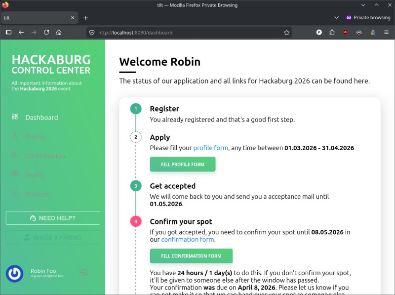
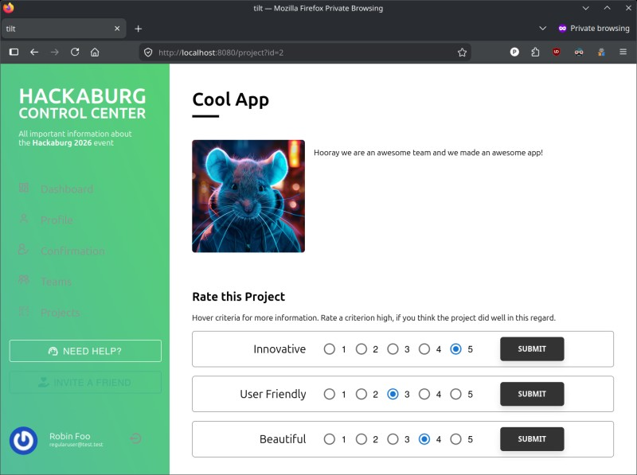

<h1 align="center">tilt</h1>

  Hackathon Registration System

<a href="docs/docs.md">Documentation</a> - <a href="docs/docker-development.md">Docker Development Quickstart</a>

  

  

  

  

 

Like many other hackathons, we previously used [Quill](https://github.com/techx/quill) for our application process, which worked really well for us in the past. Especially Quill's process was a blessing: an application consists of two steps, the profile creation and, once an attendee was admitted to the event, the spot confirmation. We attended different events that used different processes and found this to be easy for both the attendees and organizers.

Faced with maintaining our [fork](https://github.com/hackaburg/quill) with our set of changes to the application process, as well as maintaining an Angular.JS frontend and an untyped Express backend, we wanted to build a registration system  ourselves, that matched our needs on a tech stack we're more familiar with.

 

  
  &#160;
  

